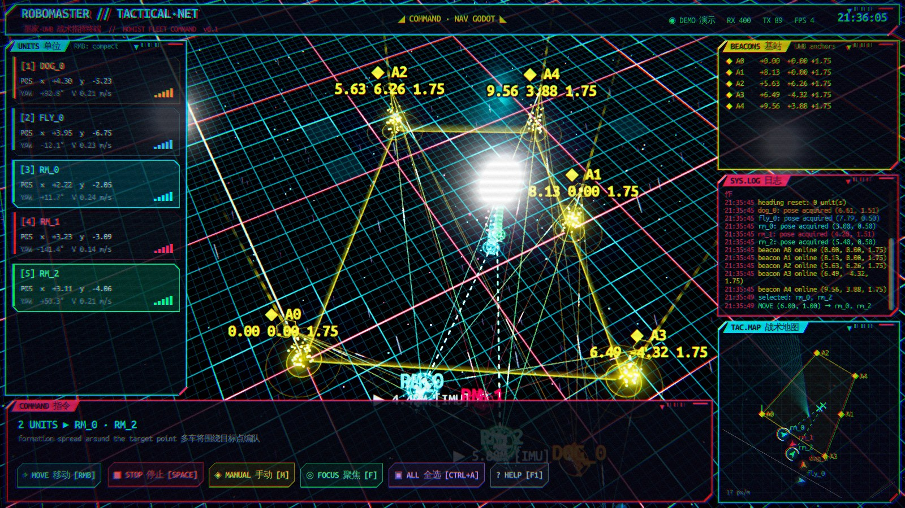
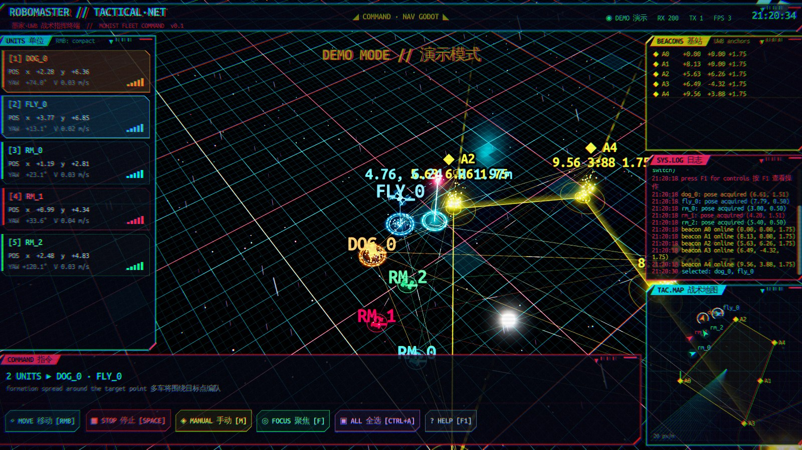
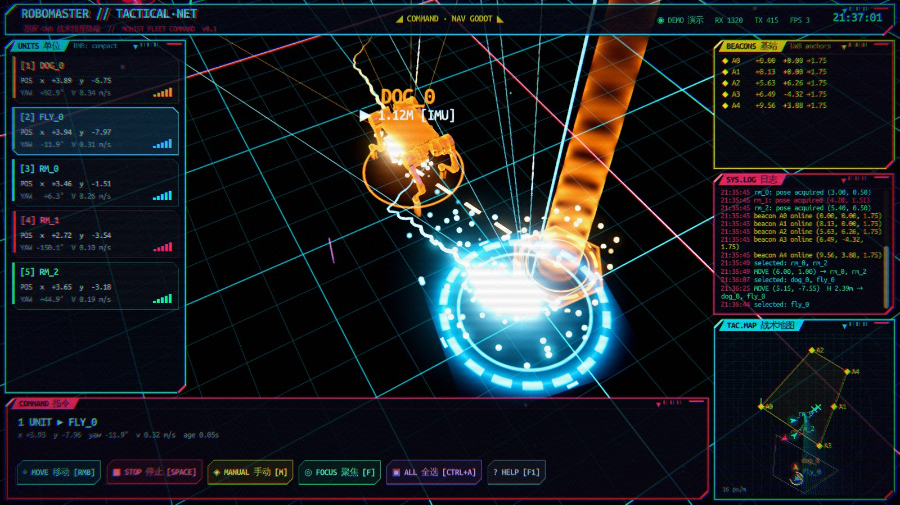
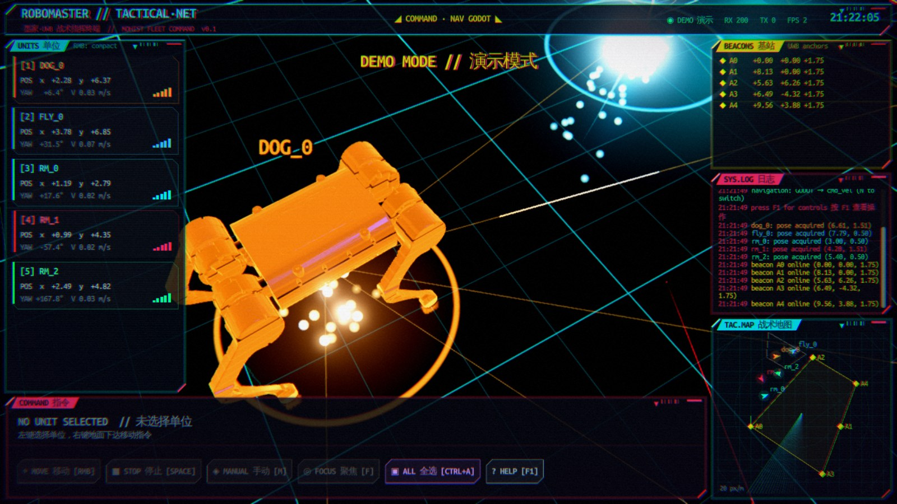
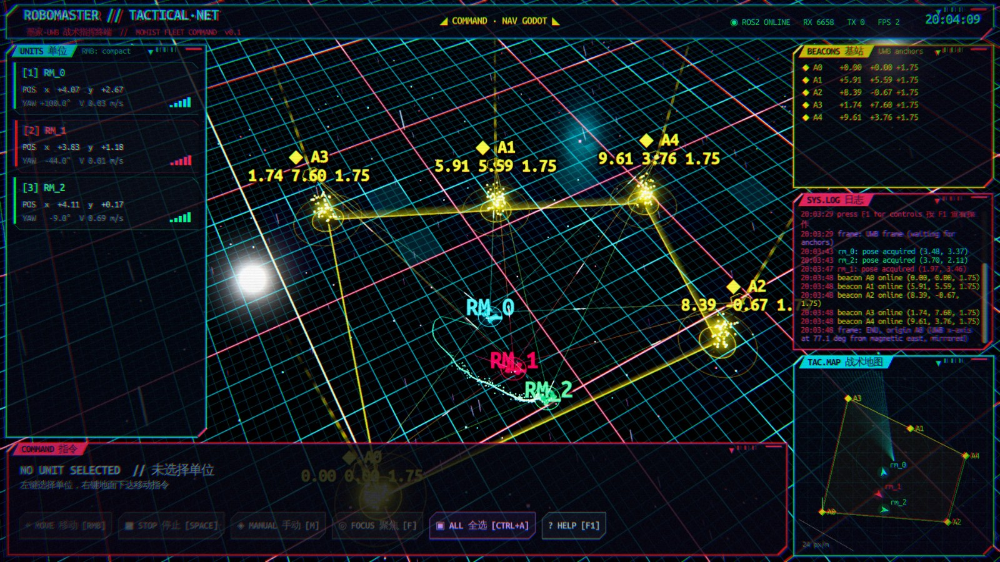
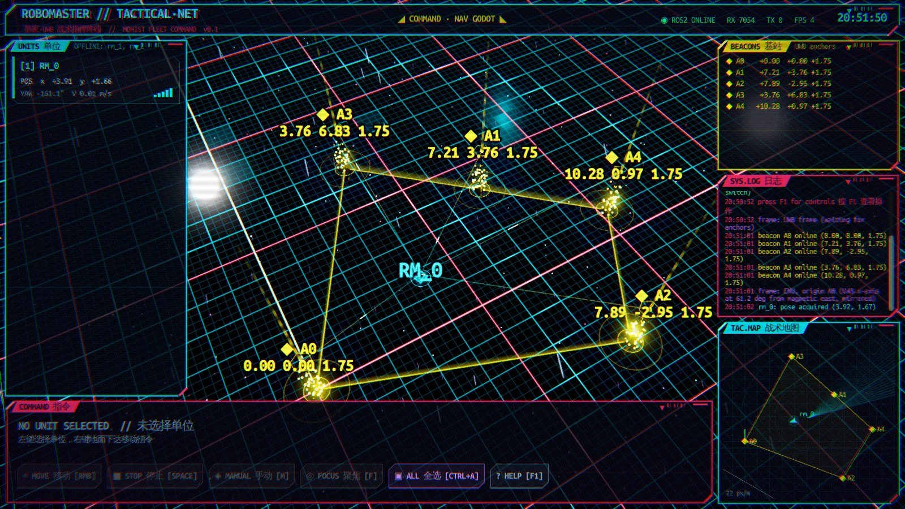
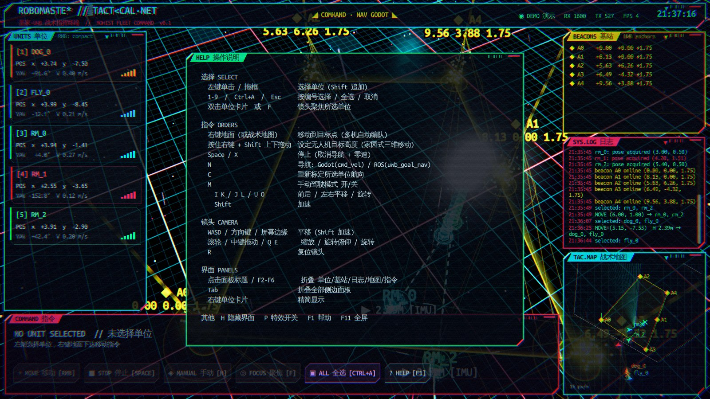

# robomaster_gui · RoboMaster Tactical Net

基于 **Godot 4.5 + GDExtension (C++/rclcpp)** 的 UWB 多机器人 RTS 风格指挥界面，赛博朋克视觉风格。
在 3D 场景中显示 UWB 基站、机器人模型与位姿，像即时战略游戏一样框选机器人、右键下达移动指令，
导航算法在 Godot 中以 UWB 坐标系为基准实现，直接发布 `cmd_vel`。



| 家园式三维移动（无人机高度） | 多种机器人：RoboMaster / Bigdog / Iris |
|---|---|
|  |  |
| **Bigdog 四足模型（URDF 装配）** | **实机数据：ENU 显示坐标系** |
|  |  |
| **掉电/离线机器人自动隐藏** | **操作说明 (F1)** |
|  |  |

## 功能

- **3D 战场**：湿地面霓虹网格（SSR 反射）、全息城市背景、霓虹雨、数据粒子、辉光与后处理（色差 / 扫描线 / 故障闪烁）。
- **基站**：`/uwb/anchors` 中的全部基站（光柱、脉冲环、标签），基站多边形围栏，基站→机器人测距连线。
- **机器人**：自动发现 `rm_<id>` / `dog_<id>` / `fly_<id>` / 任意名字，运行中新上线的机器人自动加入；按种类显示模型：
  - `rm_*` RoboMaster S1（Webots `Robomaster-S1.wbt` 网格，麦轮转动、雷达旋转）
  - `dog_*` Bigdog 四足（`robot-Bigdog-A.SLDASM` URDF 装配，对角小跑步态）
  - `fly_*` 3DR Iris 四旋翼（`Iris.proto` 网格，螺旋桨、航灯、高度线，高度取原始 UWB z）
- **RTS 操作**：单击 / Shift 追加 / 框选 / 数字键选择，右键移动（多机自动编队、互相避让），Space 停止，M 手动驾驶。
- **家园式三维移动**：按住右键定位，按住 Shift 上下拖动设定无人机高度，松开下达。
- **航向**：机器人地磁 IMU（ENU）+ 全局 UWB↔ENU 夹角，运动中自动学习并持久化，启动即得 ENU 坐标系与各机航向。
- **信号处理**：UWB 标签掉电时冻结在最后可信位置并标记 SIGNAL LOST，超过 5 s 离线自动隐藏；位置跳变时轨迹断开。
- **HUD**：单位卡片、基站列表、系统日志、战术雷达小地图（左键跳转、右键下令），所有面板可折叠，界面随窗口缩放。
- **离线演示**：无 ROS / 扩展加载失败时自动进入 DEMO 模式（模拟镜像 UWB 坐标系、IMU、各类机器人）。

## 架构

```
┌──────────────── Godot 4.5 (GDScript) ────────────────┐
│ main.gd        场景 / 输入 / 指令 / 20 Hz 导航循环     │
│ hud.gd minimap.gd move_gizmo.gd   HUD、雷达、三维移动  │
│ robot_unit.gd (抽象基类) ← robomaster/dog/drone/generic │
│ robot_registry.gd  名字前缀 → 机器人种类              │
│ nav_controller.gd  UWB 坐标系导航 → cmd_vel            │
│ heading_model.gd   IMU(ENU) ↔ UWB 航向模型 (持久化)   │
└───────────────▲──────────────────────────────────────┘
                │ GDExtension (librobomaster_gui.so)
┌───────────────┴───────── C++ RosBridge ──────────────┐
│ 独立 rclcpp Context + MultiThreadedExecutor(4) 线程   │
│ 订阅/发布、话题自动发现、显示坐标系 (A0 原点 ENU) 变换 │
└──────────────────────────────────────────────────────┘
```

GDScript 每帧轮询 `RosBridge` 的最新状态（回调只在互斥锁内保存最新值），渲染帧率与 ROS 回调互不阻塞。

## ROS 接口

| 话题 | 类型 | 方向 | 说明 |
|---|---|---|---|
| `/uwb_ekf/<robot>/pose` | PoseStamped | 订阅 | 位置（UWB 坐标系，`frame_id: world`），可用 `pose_topic` 改 |
| `/uwb/<robot>/pose` | PoseStamped | 订阅 | 原始 UWB：判断标签是否在线、无人机高度 |
| `/uwb_ekf/<robot>/pose_valid` | Bool (latched) | 订阅 | false 时忽略 EKF 位姿（标签掉电） |
| `/uwb_ekf/<robot>/heading_valid` | Bool (latched) | 订阅 | true 时 pose 的 orientation 为 UWB 系真实航向 |
| `/<robot>/odometry/filtered` | Odometry | 订阅 | IMU 航向 yaw（ENU，从磁东逆时针） |
| `/<robot>/imu/mag_state` | String | 订阅 | 地磁状态 LOCKED / HOLD / REJECTED |
| `/uwb/anchors` | MarkerArray | 订阅 | 基站坐标（UWB 坐标系，linktrack_node） |
| `/uwb_nav/<robot>/markers` | MarkerArray | 订阅 | ROS 导航（uwb_goal_nav.py）的目标与状态 |
| `/<robot>/cmd_vel` | Twist | 发布 | Godot 导航 / 手动驾驶（车体系 x 前 y 左） |
| `/uwb_nav/<robot>/goal_pose` | PoseStamped | 发布 | ROS 导航模式的目标；无人机三维目标（z = UWB 高度） |
| `/uwb_nav/<robot>/cancel` | Empty | 发布 | 停止 / 接管前取消 ROS 导航 |
| `/uwb_nav/select` | String | 发布 | 当前选择，与 RViz / uwb_fleet 同步 |

## 坐标系

- **UWB 坐标系**（话题中的位置）：由 LinkTrack 基站坐标定义，原点 A0，相对真实世界为**镜像（左手系）**，基站离地 1.75 m（`floor_z = -1.75`）。
- **显示坐标系**（界面）：原点 A0，**ENU**（x 磁东，y 磁北，z 离地高度）。
  UWB 方向角 ψ 对应的 ENU 航向为 `h·(ψ − θ)`，`h = −1`，θ 为 UWB 坐标系中磁东的方向角。
  θ 由机器人运动（UWB 运动方向 vs. IMU 航向）学习，保存在 `user://heading.cfg`
  （`~/.local/share/godot/app_userdata/RoboMaster Tactical Net/`），下次启动直接使用；尚未知道 θ 时以 A0→A1 为 +x。
- 下达的目标点在 C++ 中反变换回 UWB 坐标系后再发布，导航与 `uwb_goal_nav.py` 始终工作在 UWB 坐标系。

## 导航（Godot 端）

`NavController` 以 20 Hz 运行（`_physics_process`，与渲染帧率无关），全部在 UWB 坐标系中计算：

- 航向 `ψ = θ + h·yaw_imu + δ_robot`（全局参考 θ + 每机独立修正 δ，IMU 安装方向不同的机器人如机器狗由 δ 吸收；
  没有 δ 的机器人先测量一次），优先使用 `heading_valid` 为真的 EKF 航向；
  都没有时先沿车体 +x 行驶 0.25 m 标定。
- 比例控制 + 限速 0.3 m/s + 限加速度 + 机器人间斥力避让，全向平移（wz = 0），世界速度按航向与手性换算为车体 `cmd_vel`。
- 行驶 / 手动驾驶时持续比较“车体指令方向”与“UWB 观测运动方向”在线修正 θ、δ；偏差持续 > 100° 自动停车重新标定。
- `N` 键可切回 ROS 导航（发布 `goal_pose` 给 `uwb_goal_nav.py`）；无人机始终只发布三维 `goal_pose`，不发 `cmd_vel`。

## 编译

依赖：ROS 2 Humble、Godot 4.5 编辑器可执行文件、用 SCons 预编译的 godot-cpp（`template_debug`）。
默认目录布局（可用 CMake 变量 `GODOT_CPP_DIR` / `GODOT_BIN` 修改）：

```
<ws>/src/godot/bin/godot.linuxbsd.editor.x86_64     # Godot 4.5
<ws>/src/godot-cpp/                                 # 含 bin/libgodot-cpp.linux.template_debug.x86_64.a
<ws>/src/robomaster_gui_node/                       # 本包
```

```bash
cd <ws>/src/godot-cpp && scons platform=linux target=template_debug   # 只需一次
touch <ws>/src/godot/COLCON_IGNORE <ws>/src/godot-cpp/COLCON_IGNORE
cd <ws> && colcon build --packages-select robomaster_gui_node
```

编译后 `librobomaster_gui.so` 同时复制到 `godot_project/bin/`，可以直接用 Godot 编辑器打开 `godot_project/` 调试。

## 运行

```bash
source <ws>/install/setup.bash
ros2 launch robomaster_gui_node robomaster_gui.launch.py                 # 自动发现机器人
ros2 launch robomaster_gui_node robomaster_gui.launch.py fullscreen:=true
ros2 run robomaster_gui_node robomaster_gui --demo                       # 离线演示
```

首次启动会先 headless 导入模型资源；在双显卡笔记本上启动脚本自动使用 NVIDIA 独显（PRIME offload）。

| launch 参数 | 默认 | 说明 |
|---|---|---|
| `robots` | `auto` | `auto`：有 `nlink_parser2/config/uwb_tags.yaml` 时用其中的 `tag_names`，否则按话题自动发现；或逗号列表 |
| `tags_file` | 空 | UWB 标签映射文件（默认取 nlink_parser2 的 `config/uwb_tags.yaml`） |
| `drive_kinds` | `rm,dog` | 允许用 `cmd_vel` 驱动的机器人种类（`all` 为全部），其余只显示 |
| `cmd_domains` | `dog=78` | 某类机器人 `cmd_vel` 所在的 DDS 域（Go2 的 go2_sport_bridge 在域 78），GUI 为其单独建 rclcpp context |
| `pose_topic` | `/uwb_ekf/{}/pose` | `{}` = 机器人名 |
| `cmd_topic` | `/{}/cmd_vel` | |
| `anchors_topic` | `/uwb/anchors` | UWB 坐标系基站 |
| `origin_anchor` / `axis_anchor` | `0` / `1` | 显示原点；无 θ 时 +x 指向的基站 |
| `floor_z` | `-1.75` | UWB 坐标系中地面高度 |
| `display_anchors_topic` | 空 | 可选：改用该话题坐标系显示（如 `/uwb_viz/rm_0/anchors`，仿射拟合） |
| `spacing` | `0.5` | 编队间距 [m] |

GUI 参数（`--` 之后）：`--frame enu|axis`、`--nav godot|ros`、`--demo`、`--autoplay`、`--fullscreen`；
环境变量 `RMGUI_PROFILE=1` 每秒打印帧时间。

## 操作

| 操作 | 按键 |
|---|---|
| 选择 / 追加 / 框选 | 左键 / Shift+左键 / 左键拖框，`1-9`、`Ctrl+A`、`Esc` |
| 移动（多机编队） | 右键地面或战术地图 |
| 无人机高度 | 按住右键 + `Shift` 上下拖动，松开下达 |
| 停止 | `Space` / `X` |
| 手动驾驶 | `M`，`I K` 前后、`J L` 平移、`U O` 旋转、`Shift` 加速 |
| 导航方式 / 重新标定航向 | `N` / `C` |
| 镜头 | `WASD` / 方向键 / 屏幕边缘平移，滚轮缩放，中键拖动旋转，`Q E` 旋转，`F` 聚焦，`R` 复位 |
| 界面 | `F1` 帮助，`F2-F6` / 点击标题折叠面板，`Tab` 折叠侧栏，右键卡片精简，`H` 隐藏 HUD，`P` 特效，`F11` 全屏 |

## 新增机器人种类

1. 新建 `godot_project/scripts/xxx_unit.gd`：`extends RobotUnit`，实现 `_build_body()`（模型挂到 `_body` 下，x 前 y 上，地面 y = 0），
   按需重写 `_animate()`、`kind_can_drive()`、`can_fly()`、`kind_tag()`、`hover_height()`、`ring_size()`、`label_height()`。
2. 在 `robot_registry.gd` 的 `KINDS`（及 `HUES`）中加一行前缀映射，例如 `"car": preload("res://scripts/car_unit.gd")`。

模型网格放在 `godot_project/assets/models/`。STL/OBJ 可用 `tools/decimate_obj.py` 转换与减面（Godot 不支持 STL）。

## 目录

```
src/                  GDExtension：ros_bridge.{h,cpp}, register_types.cpp
godot_project/        Godot 工程（scenes / scripts / shaders / assets/models）
launch/               robomaster_gui.launch.py
tools/                robomaster_gui.in（启动脚本）, decimate_obj.py（网格转换/减面）
images/               截图
```

## 已知限制

- 无人机三维目标发布到 `/uwb_nav/<fly>/goal_pose`，需要无人机侧有节点执行。
- θ 初值来自一次运动标定，可能有几度误差；机器人运动后自动修正。
- Godot 4.5 RC 的独立渲染线程模式退出时会崩溃，因此未启用。
